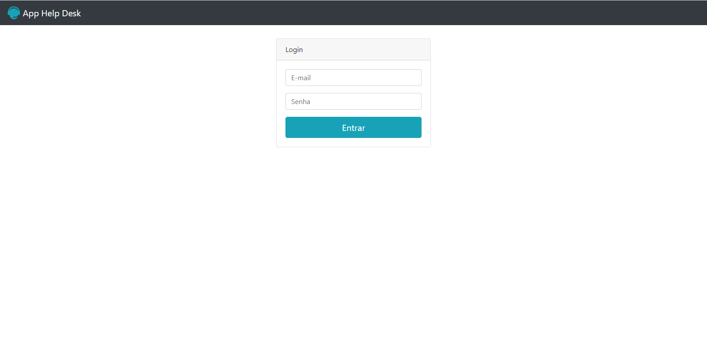

# Help-Desk
Uma aplicação de abertura de chamado feito em aula do PHP 7

<!DOCTYPE html>
<html lang="pt-br">

<head>
  <meta charset="UTF-8">
  <meta http-equiv="X-UA-Compatible" content="IE=edge">
  <meta name="viewport" content="width=device-width, initial-scale=1.0">
  <title>Help-Desk</title>
</head>

<body>
  <h1>Tela de login</h1>
  
</body>

</html>